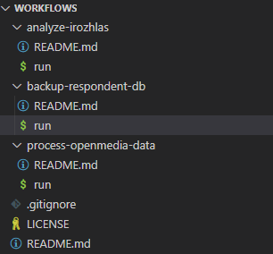

# Workflows

Here you can find programs/scripts and documentation of automated business processes (workflows/pipelines), important for the running of the department. Each workflow can belong to one or more business processes, see our (knowledge base)(https://github.com/czech-radio/organization/tree/main/docs/Software/Processes).

## Create workflow

- Each workflow is placed in an appropriately named directory (Use the imperative e.g. `do-this`).
- Each workflow is well documented in source and `README.md`.
- Each workflow contains an input script named `run` (Bash, Python, etc.).

## What does the project structure look like?

(Visual Studio Code)


## How do we run them on the server?

```bash
source workflows/backup-respondent-db/run
```

## How do we update the workflow on the server?

```bash
cd workflows && git pull && cd ..
```
